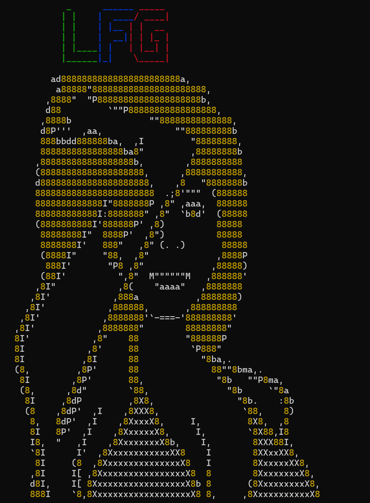

# lfg

CLI tool for launching project folders in [opencode](https://opencode.ai).



## Install

```bash
npm install -g git+ssh://git@github.com:shaunkahler/lfg.git
```

## Usage

```bash
# Add folders to your lineup
lfg add /path/to/project

# List all folders
lfg list

# Remove a folder from lineup
lfg remove 1

# Launch the picker (default command)
lfg
```

### Picker Controls
- **UP/DOWN arrows** - Navigate folders
- **ENTER** - Open selected folder in opencode
- **ESC** - Exit
